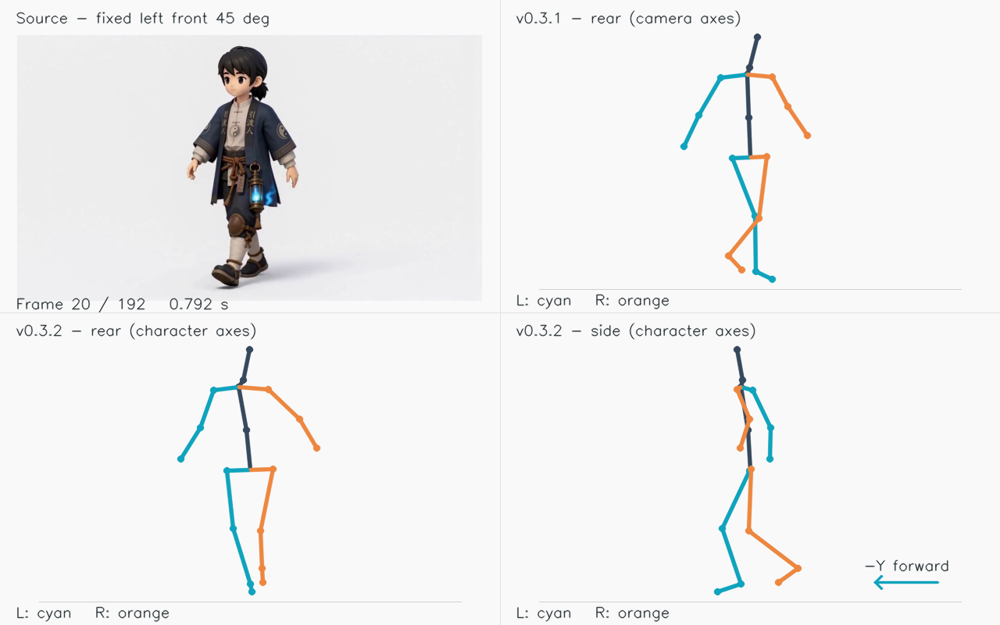

# v0.3.2 固定左前 45° 与 −Y 朝向

验证日期：2026-09-15。此版修复模型相机坐标直接被当作角色坐标应用的问题。新增固定相机外参转换与有界的初始朝向校准，继续使用 v0.3.1 头部／足部求解。

## 使用方法和视角约定

1. 安装 `motion_capture-0.3.2.zip` 后重启 Blender，选择素材。
2. “素材相机视角”选择 **固定左前 45°**，启用 **初始朝向对齐 −Y**。新场景默认使用这两个设置。
3. 重新生成动捕，核对“素材角”“正面”“背面”“侧面”，再确认并应用到 Rigify。
4. 来自其他方向或移动相机的素材，选“未指定／其他视角”。加载历史结果会恢复历史设置，缺少视角字段的旧结果按“未指定”读取；更改捕捉设置后需要重新生成，不能复用旧缓存。

左前以**角色自身**为准：正前方为 Blender 世界 −Y，左侧为 +X；相机在 (+X, −Y) 象限，水平夹角 45°。45° 不代表俯视角，本版不假设相机抬高 45°。相机整段固定，角色以开头的朝向为参考，后续真实转身保留；若相机始终绕着转身中的角色移动，该设置不适用。

Quality 与 Quality Plus、Preview 共用此坐标处理。它不识别动作类别，也不生成走路模板，因此可用于跑步、攻击、待机、横向迈步等相同相机条件的素材。两种 Quality 模式仍使用原有模型区别。

## 实现和边界

- MotionBERT／MediaPipe 输出先进入相机标准坐标 `(image_right, optical_depth, up)`，脚部图像拟合和面部 PnP 均在此空间完成。
- 固定左前相机对应绕世界 Z 轴 **+45°** 的相机到角色坐标旋转。不是 −45°，也不是交换 X/Y 或改变左右标签。
- 可选初始校准取开头 0.25 秒内可信的髋部横轴，估计小幅模型偏差，整段只应用一个固定旋转。使用髋部而非肩部，避免把躯干扭转当作全身朝向。参考摆动超过 10°、偏差超过 20°、遮挡或髋横轴过于竖直时不强制校准，结果中提示 `CAMERA_HEADING_REVIEW`，保留已知相机的 +45° 转换。此时不保证初始髋部精确朝向 −Y。
- 初始可信髋部的参考方向对齐世界 −Y，不将每一帧头、胸、脚尖都强制朝向 −Y。真实头部旋转、躯干扭转、脚掌内外旋、转身仍保留。
- 所有身体／手部点绕同一世界原点转换；头部／脚部世界四元数左乘同一旋转。根轨迹、骨长、关节夹角、接触时序保持不变。不逐帧改变髋、膝、踝的相对位置。
- 原始／处理后结果使用相同校准，加载和 Rigify 应用不再次旋转；镜像与手动倾斜校正仍在之后执行。新增 `capture_transform` 保存捕捉时的坐标变换来源，预览诊断同时记录。该字段记录捕捉变换，不代表用户之后的镜像或手动校正。
- “素材角”反向使用实际应用的水平旋转，便于比较同一模型投影。俯仰仍为预览展示角度，不声称恢复了视频精确相机内外参。

**这次没有重新估计腿部深度。** 已知相机方向解决坐标基准错位，不能仅凭一张图唯一恢复遮挡或有歧义的关节深度。也没有压制真实横向迈步。若从背面仍能看到不合理的腿部变化，需进一步用可见关节、人物比例、相机俯仰／投影信息约束三维重建，而不能用“更平滑”或强制前后摆动作为正确性的证据。

## 192 帧行走素材复测

复用 `角色行走.mp4` 的全 192 帧 Quality 真实推理缓存（24 FPS，8 秒），运行当前生产后处理、相机转换、导出和预览元数据写入。此版没有改模型推理，未重复下载或运行模型。基线为 v0.3.1 同一视频结果。

- 已知相机旋转 +45°，初始髋部模型偏差校正 −5.0141°，整段总转换 +39.9859°。
- 开头参考髋部朝向：−39.9864° → −0.0006°；处理后全段范围约 −1.83° 至 +0.48°。
- 截图时刻 0.167 秒：髋部 −0.019°、肩部 +6.146°；0.792 秒：髋部 −1.825°、肩部 +15.698°。保留肩／髋相对扭转，不声称肩线应与髋线始终重合。

| 脚踝相对同侧髋部的整段摆幅 | v0.3.1 相机坐标 | v0.3.2 角色坐标 |
|---|---:|---:|
| 左侧 X 横向 | 36.81 cm | 17.06 cm |
| 左侧 Y 前后 | 27.19 cm | 43.56 cm |
| 右侧 X 横向 | 35.57 cm | 16.97 cm |
| 右侧 Y 前后 | 20.79 cm | 37.96 cm |

这些数据表明变换后以前后摆动为主，**是坐标分量统计，不是三维准确率**。剩余横向分量保留，未证明其全部为真实动作，也未将其全部判为误差。逆向转换回素材坐标，全部身体点的最大差约 `2.01e-16 m`，说明此次变换没有改变源三维姿态。

下图为 0.792 秒同步对照：左上原视频、右上旧版背面、左下新版背面、右下新版侧面。完整 8 秒对照视频为 `.cache/v03-camera/camera-comparison.mp4`。

## 验证与交付

- 确定性测试：左前相机符号、已知姿态往返、独立头脚四元数、根轨迹、后续 90° 转身、遮挡／视角冲突、骨长／夹角／接触不变、镜像、旧字段兼容、缓存失效与元数据校验。
- 生产 pipeline 集成测试：仅替代昂贵推理和模型预检，实际运行后处理、相机转换、导出／加载和预览 sidecar；确认图像拟合前不旋转，原始／处理后使用同一变换。
- Blender 4.5.0：实际 Rigify 应用全 192 帧，头、双脚、大腿、小腿控制骨世界方向与结果一致（角误差小于 0.1°）；保留原 Action。现有对象变换、父级、变形骨、取消回滚测试继续覆盖。未重新进行交互式 Ctrl+Z 人工检查。
- 单元测试全量 361 项通过，随后增加的元数据校验与受影响结果校验 37 项通过（有重叠）；Blender 302 项检查通过；Quality／Preview worker、环境和 CUDA 算子通过。四类动作保真 20 个组合通过。此前其他动作类别的真实识别质量未通过项继续保留，不因坐标修复改为通过。

复测脚本：`tools/validate_camera_alignment.py`。实测结果与报告在 `.cache/v03-camera/`，包括 `mocap_result.json`、`preview_manifest.json`、`validation.json`、`blender-validation.json` 与 `verified-animation.blend`。安装包保存在 `dist/motion_capture-0.3.2.zip`。
