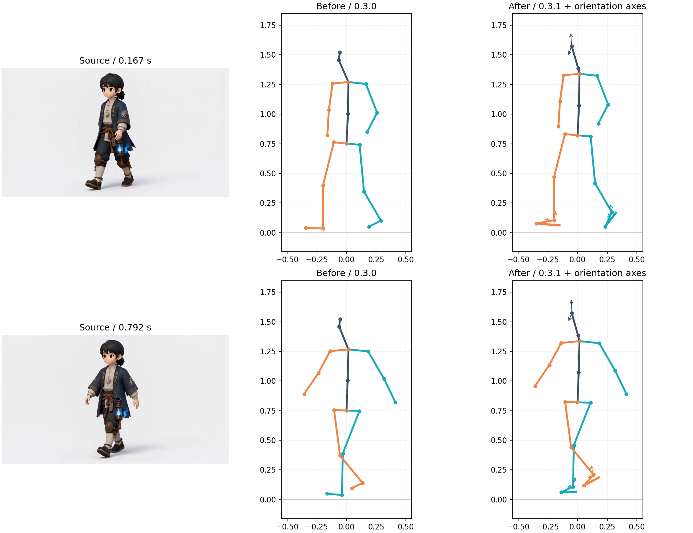

# v0.3.1 头部与脚掌修复报告

本次完成 v0.3 正式版的头部与脚掌修复迭代，安装包版本为 **0.3.1**，以区别此前 0.3.0 开发验收包。开发与验证环境为 Blender 4.5.0、Python 3.10.0、RTX 4060 Laptop 8 GB；验证日期为 2026-09-14 至 09-15。

## 修复内容

- Quality 默认使用 WholeBody 的身体、脚跟、大小脚趾及面部观测；原“身体与脚部增强”作为兼容入口。Quality Plus 保留 RTMPose-x 身体观测，并补充 WholeBody 面部与脚部。预检及下载依赖同步更新，缺少增强模型时明确提示。
- 脚部改为以脚踝为锚点的刚性足部拟合，固定整段足长，使用二维投影与连续朝向约束深度分支。删除小腿与竖直轴叉积外推脚尖及固定世界前向符号的旧路径。
- 旋转采用四元数，短缺口插值、长缺口释放到身体朝向；较低置信度的脚部观测使用更强的居中去抖，保留连续转身和抬脚。膝盖接近伸直时保留连续弯曲参考。
- 保持 MotionBERT 的模型输入格式，在输出端重建头部中心与颈部位置，避免把鼻子代理点直接当作颈部。面部点通过 PnP 独立求解转头、抬低头及歪头，Rigify `head` 不再固定跟随父骨。
- 预览、镜像、倾斜校正、导出和 Rigify 应用共用同一朝向数据。预览新增前向／上向标记；灰色表示估算。旧结果可以读取，旧处理版本需要重新生成后才能作为本次修复结果应用。

## 同一完整视频的实测

使用本地 `角色行走.mp4` 全部 **192 帧、24 FPS、8 秒**，重点检查截图对应的 **0.167 秒**与 **0.792 秒**。修改前代码单独从 Git 基线导出，使用旧 `quality_feet`；新代码使用 Quality。两者使用相同 WholeBody 模型，逐帧二维观测的最大差为 **0**，保证比较不受模型切换或素材差异干扰。

下表是与二维检测方向的投影角度差。脚部在两个版本中均比较“脚踝→大小脚趾中点”，与实际 `foot_fk` 控制骨使用的端点一致；头部比较双眼横轴方向。它反映图像平面的一致性，**不是人工三维真值误差，也不能衡量被遮挡方向的准确率**。

| 指标 | 修复前中位数 | 修复后中位数 | 修复前 95 分位 | 修复后 95 分位 |
|---|---:|---:|---:|---:|
| 左脚方向误差 | 29.80° | 1.54° | 53.53° | 5.88° |
| 右脚方向误差 | 13.75° | 1.54° | 35.57° | 6.83° |
| 头部横轴方向误差 | 8.21° | 6.03° | 11.96° | 7.54° |

新 Quality 的头部、左脚、右脚最大逐帧旋转变化分别为 **5.68°、19.91°、20.71°**；Preview 分别为 **5.44°、17.17°、18.70°**，均无超过 45° 的单帧突变。两条链路在本段视频的 192 帧中均有可用观测；Preview 深度仍明确标为近似估算。

新旧结果的膝盖、脚踝相对骨盆坐标最大差小于 **0.000002 米**，处于导出舍入量级。脚掌方向变化没有反向改变这段素材的腿部姿态。新增隔离测试也确认：单独扰动脚掌观测，在锁脚关闭和开启时均不会产生髋、膝、踝的额外运动。

新足部重建完成后，用一个固定高度平移整段根相对数据来确定估计地面；没有逐帧抬腿、压腿或强制锁死脚尖。最终脚趾／脚跟最低 Z 为 **0 米**。这不等于每个支撑帧都能完全贴地，原始脚踝深度和接触识别仍影响鞋底高度。

## 验证结果

- **355 项单元测试通过**：包括四元数读写、非法数据、镜像、倾斜校正、过期缓存、短长遮挡、连续旋转、膝盖退化以及脚掌／腿部隔离。
- **300 项 Blender 检查通过**：包含独立头部、脚掌双轴、实际 FK 变形、不同对象旋转和缩放、原 Action 保留及取消回滚。既有应用流程与撤销实现保留；本次自动化验证包括回滚，未重新进行前台 Ctrl+Z 人工验收。
- **Quality 22 项 worker 测试通过**；Preview 同一测试集 20 项通过、2 项按环境跳过。新增 Quality Plus 身体与增强观测合并测试。
- 已知三维合成观测的头部三轴、足部正面／侧面／背面和滚动测试达到 **5° 以内**；15／24／30／60 FPS 连续旋转没有新增相位延迟。
- **20 组既有动作保真测试通过**；走路、跑步、攻击、待机和混合预设没有回归，既有固定支撑滑动测试仍改善约 70%。Quality、Preview 环境检查与 CUDA 算子检查通过。
- 对真实视频全部帧另行应用到生成的 Rigify Human，保存可复核 Blender 工程及每个朝向控制骨的误差报告。

## 使用与复核

安装 `dist/motion_capture-0.3.1.zip`，重新启动 Blender 或重新加载插件，选择 **Quality（身体、脚掌与头部）** 并重新生成动捕。旧三维结果没有新朝向字段，不能靠重新打开预览获得本次修复。

依赖缺失时运行 `tools/download_models.ps1 -Profile quality`。已有 WholeBody 模型可以复用；插件 ZIP 不包含第三方模型权重或 Python 环境。模型许可状态延续原有说明。

复核材料位于仓库 `.cache/v03-orientations/`：

- `baseline/`：修改前代码对同一视频的结果。
- `capture_quality/`、`capture_preview/`：完整新推理结果、二维观测、原始与最终三维、逐帧朝向可信度和诊断。
- `comparison.json`、`comparison.png`：方向投影误差和重点帧对照。
- `verified-animation.blend`、`blender-validation.json`：全部真实视频帧应用后的 Rigify 动画和骨骼方向误差。

复现入口：`tools/validate_orientations.py --capture`、`tools/render_orientation_comparison.py`、`tools/validate_orientation_blender.py`。前两项使用 Quality worker Python；最后一项通过 Blender `--background --factory-startup --python-exit-code 1 --python` 运行。`--reprocess` 只重跑保存的原始朝向后处理，其耗时不能当作完整模型推理耗时。

头部使用通用脸部参考和估计相机内参；风格化人物比例、正侧脸遮挡、运动模糊仍可能造成偏差。本轮修复不扩展表情、口型或真实世界轨迹，也不把此前未通过的四类动作通用识别验收改为通过，历史记录见 [v0.3 验收记录](V0_3_VALIDATION.md)。
